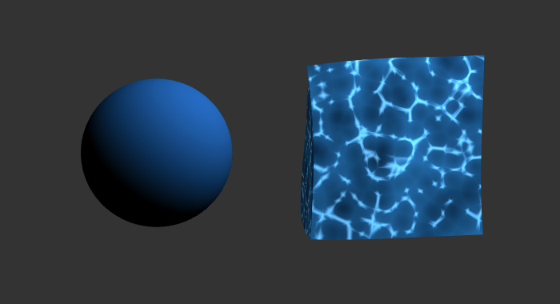

# HW 0: Intro to Javascript and WebGL

Ximing Luo

Live demo: https://ximluo.github.io/hw00-intro-base/



## What's in it

- A `Cube` class that extends `Drawable`. Each face is split into a grid so the vertex shader has something to move.
- A color picker in the GUI that feeds `u_Color` to the shaders.
- A fragment shader for the cube that uses 3D Worley noise to fake water. The nearest feature point distance sets the water depth and the gap between the two nearest distances draws the bright caustic lines. The noise input drifts over time.
- A vertex shader for the cube that pushes each vertex around with a few sine waves of position and time.
- A `u_Time` uniform that gets incremented every frame in `main.ts`.

The icosphere still uses the base Lambert shader.

## Run it

```
npm install
npm run dev
```
